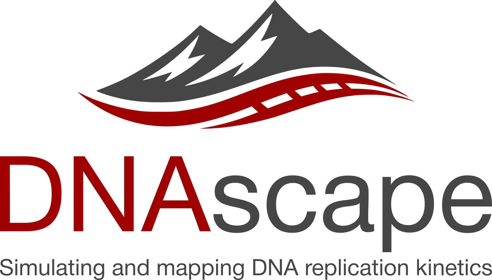

<p align="center">
  
</p>

# DNAscape

**DNAscape** is a computational framework for simulating, mapping, and analysing DNA replication kinetics at genome scale.  
It provides a unified set of models and tools to connect replication origin activity, fork dynamics, and replication timing under flexible mechanistic assumptions.

DNAscape is designed to support both **data integration** and **hypothesis-driven modelling**, enabling systematic exploration of DNA replication programmes in normal and perturbed conditions, including replication stress.

---

## Key features

- Genome-scale simulation of DNA replication dynamics  
- Flexible modelling of origin firing and fork progression  
- Mapping between replication timing, origin activity, and fork directionality  
- Support for ensemble simulations and stochastic variability  
- Designed for integration with experimental datasets (e.g. Repli-seq, OK-seq)

---

## Documentation

Full documentation, including installation instructions, tutorials, and API reference, is available at:

👉 **https://dnascape.readthedocs.io/en/latest/**

The documentation includes:
- Installation and environment setup  
- Worked examples and notebooks  
- Conceptual overview of the modelling framework  
- Detailed function and module reference  

---

## Installation (quick start)

```bash
git clone https://github.com/fberkemeier/DNAscape.git
cd DNAscape
python -m venv .venv
source .venv/bin/activate
pip install -r requirements.txt
