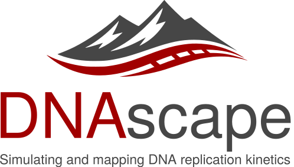

<p align="center">
  
</p>

# DNAscape

[](https://dnascape.readthedocs.io/en/latest/)

DNAscape is a computational framework for simulating, mapping, and analysing DNA replication kinetics at genome scale. It provides a unified modelling environment linking replication origin activity, fork propagation, and replication timing through explicit mechanistic assumptions.

The framework integrates replication datasets such as Repli-seq, SNS-seq, and OK-seq into a quantitative kinetic model, enabling genome-wide reconstruction, hypothesis testing, and simulation of alternative mechanistic scenarios.

## Key features

- Genome-wide simulation and analysis of DNA replication kinetics.
- Explicit modelling of origin firing, bidirectional fork progression, fork speed, and inter-origin distances.
- Mapping between replication timing, origin activity, fork directionality, and related latent kinetic parameters.
- Stochastic ensemble simulations to capture variability in origin firing and fork dynamics.
- Support for replication stress modelling, including fork stalling and heterogeneous fork behaviour.
- Integration with replication datasets such as Repli-seq, SNS-seq, and OK-seq.
- Reproducible notebook-based example workflows.

## Requirements

- Python >= 3.9

## Installation

```bash
git clone https://github.com/fberkemeier/DNAscape.git
cd DNAscape
pip install -r requirements.txt
pip install -e .
```

## Basic usage

```python
from dnascape import *
```

## Documentation

Full documentation (installation details, tutorials, conceptual background, and API reference):

- [Documentation](https://dnascape.readthedocs.io/en/latest/)

## Citation

If you use DNAscape in your research, please cite the corresponding publication.

## Questions, bugs, and feature requests

Open an issue:

- https://github.com/fberkemeier/DNAscape/issues

For technical questions or collaboration requests, contact Francisco Berkemeier at fp409@cam.ac.uk.